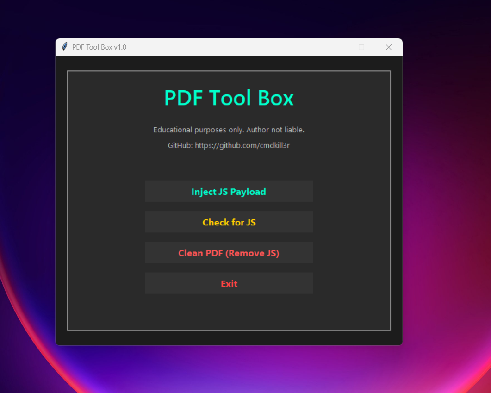

PDF Tool Box
---


> PDF Tool Box lets you safely inject JavaScript, scan for malicious code, and clean PDFs—all in one professional, easy-to-use application. This tool is intended strictly for educational purposes, testing, and learning how PDFs can be manipulated safely.  

---

## Table of Contents
- [Features](#features)
- [Screenshot](#screenshot)
- [Requirements](#requirements)
- [Installation](#installation)
- [Usage](#usage)
- [Files Included](#files-included)
- [GitHub](#github)
- [License](#license)

---

## Features

- **Inject JS Payload** – Select a PDF and a JavaScript file to inject code directly.  
- **Check for JS** – Scan any PDF to detect if it contains JavaScript code.  
- **Clean PDF** – Remove all JavaScript from a PDF, making it safe for sharing.  
- **Modern Dark GUI** – Matte/glass aesthetic, hover effects, and intuitive buttons with icons.  
- **Pop-up Guidance** – Clear prompts for file selection and saving to avoid confusion.  

---

## Screenshot

  

---

## Requirements

- Python 3.10+  
- [PyPDF2](https://pypi.org/project/PyPDF2/)  
- [Tkinter](https://docs.python.org/3/library/tkinter.html) (usually included with Python)  

---

Installation
---

1. **Clone this repository:**

```bash
git clone https://github.com/cmdkill3r/pdf-tool-box.git
cd pdf-tool-box
```

Install dependencies:
---
```
pip install -r requirements.txt
```

Run the application:
---
```
python main.py
```
---
Usage
---
Inject JS Payload

Click the Inject JS Payload button.

Select the PDF file you want to inject.

Select the JavaScript file.

Choose a location to save the new injected PDF.

Check for JS

Click the Check for JS button.

Select a PDF to scan.

Receive a pop-up indicating if JavaScript is present.

Clean PDF

Click the Clean PDF (Remove JS) button.

Select the PDF to clean.

Choose a save location for the cleaned PDF.

---

Files Included
main.py – Main Python application.

js_payload.js – Example JavaScript payload for testing.

test.pdf – Sample PDF for testing injection and cleaning.

requirements.txt – Required Python packages.

screenshots/gui.png – Screenshot of the GUI.

GitHub
For updates, issues, and more tools, visit: https://github.com/cmdkill3r

License
This project is licensed under the MIT License.

Disclaimer: This tool is strictly for educational purposes. The author is not responsible for misuse.
